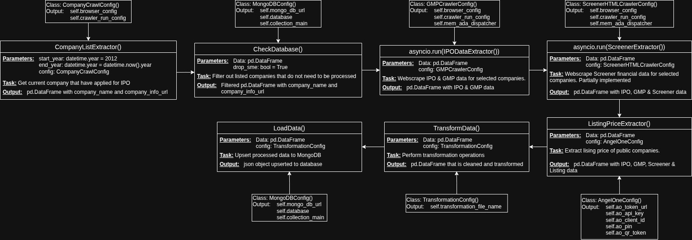
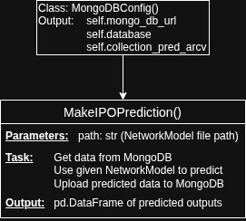
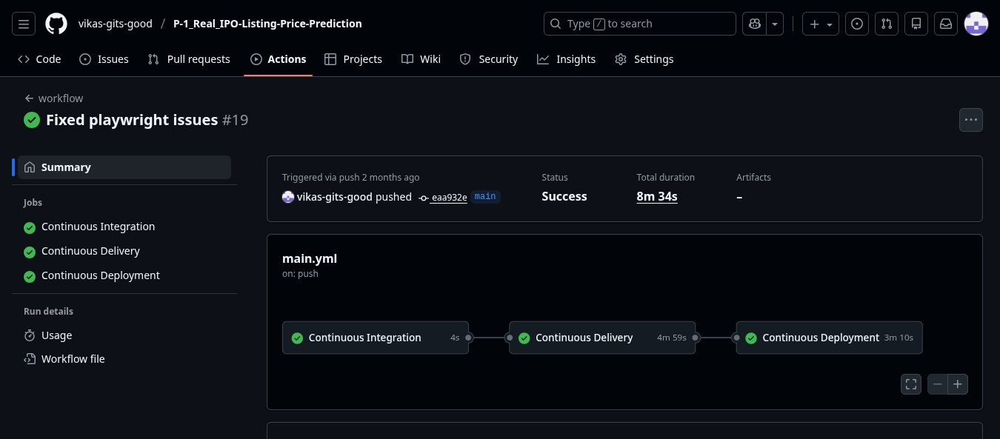
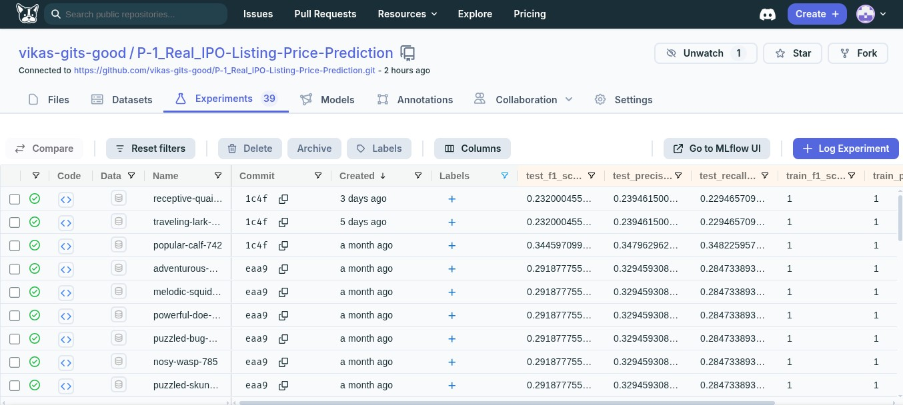

# P-1_Real_IPO-Listing-Price-Prediction
An end-to-end ML web app deployed in AWS EC2 instance to predict listing gain (%) of IPOs in Indian Stock Market.


## Abstract
Investing in IPO for listing gains is a very lucrative way to make potentially make money with relatively low time and effort invested. Currently most people refer to broker for advice on IPO investment choices and in some cases tend to be delayed or not updated on their website. This project aims to build a fully automated system that can monitor companies going public, look at their financials and predict expected listing gains. This project was inspired by this paper [Experimenting with Multi-modal Information to Predict Success of Indian IPOs](https://arxiv.org/abs/2412.16174). The dataset from this paper **was not used** instead, data was scraped manually.


## Vision
A fully automated web application that will scrape to find companies currently going public, and use that to predict expected listing gains (%). The system must also use this data to retrain the model. The end user has the option to run each of the ETL, Training and Inference Pipelines and the logs during the process is displayed. The end user can also experiment with predicting gains by selecting various models from a drop down list.


## Status
* Successfully completed project and verified deployment on AWS EC2 instance. [Check here](https://github.com/vikas-gits-good/P-1_Real_IPO-Listing-Price-Prediction/actions/runs/18843523877).
* Deleted EC2 instance after use to avoid billing.
* If prospective employers want a live demo of the project, please let me know the day before the meeting so that I can set this up again.
* There were some website GUI design changes from the sites I scrape the data from and as a consequence the **ETL Pipeline broke**. This has caused issues downstream. I plan to rectify this after completing this project: [Psychology Q&A GraphRAG Agentic AI Chatbot](https://github.com/vikas-gits-good/P-2_Real_Agentic-AI-Chatbot-on-JAP).


## Results
* Model performance is horrible. It is overfitting the dataset. `f1_score` is ~40% on validation set and ~30% on test set.
* This project currently is to showcase my ability to build projects end-to-end.
* Future work will be to improve this iteratively.


## Pipelines
1. **ETL Pipeline:** Manages data collection, processing & updating.
    * **CompanyListExtractor** will scrape all company data within a time range using **CompanyCrawlConfig** to output a list of companies & urls.
    * **CheckDatabase** will call data from MongoDB using **MongoDBConfig** and filter out the existing data to output a filtered dataframe of companies & urls.
    * **IPODataExtractor** is an async function that will scrape IPO & GMP data from multiple sites using [crawl4ai](https://github.com/unclecode/crawl4ai) package with **GMPCrawlerConfig** to output a dataframe with IPO & GMP data.
    * **ScreenerExtractor** is an async function that will scrape [screener](https://www.screener.in/) website for selected companies financial data using **ScreenerHTMLCrawlerConfig** to output a dataframe with IPO, GMP & Screener data.
    * **ListingPriceExtractor** will use **AngelOneConfig** to make API calls and get the listing price of companies that are already listed.
    * **TransformData** main class will call **DataTransformer** sub class with **TransformationConfig** which will transform the data. Essentially it updates subscription columns, creates target column and reorder the dataframe.
    * **LoadData** main class will call **DataLoader** sub class with **MongoDBConfig** which will load the data to MongoDB. Essentially is uses parallel upsert operation to update existing data or create new data.

Below is the ETL Pipeline Flowchart. Flow chart images is [stored here](https://github.com/vikas-gits-good/P-1_Real_IPO-Listing-Price-Prediction/tree/main/docs/Images/).





2. **Training Pipeline:** Process data, train models and upload artifacts and models to AWS S3 bucket.
    * **DataIngestion** along with **DataIngestionConfig** will get data using **MongoDBConfig**. It will use data from July 2012 to the previous month at runtime. This data is then split into train, validation & test sets and outputs **DataIngestionArtifact** containing file paths.
    * **DataValidation** along with **DataValidationConfig** & **DataIngestionArtifact** will validate the column in all three datasets and check the data drift distribution between train-validation and train-test sets and outputs **DataValidationArtifact** containing file paths to valid, invalid  datasets and drift report.
    * **DataTransformation** along with **DataTransformationConfig** & **DataValidationArtifact** will create a [scikit-learn](https://github.com/scikit-learn/scikit-learn) `Pipeline` object with all the data transformation strategies. This object is then used to `fit_transform()` on the train set and saved to file. This fitted pipeline object will be used to `transform()` the validation and test set. All three datasets are then converted to [numpy](https://github.com/numpy/numpy) arrays and then outputs **DataTransformationArtifact** containing the file paths.
    * **ModelTrainer** along with **ModelTrainerConfig** & **DataTransformationArtifact** will train multiple models using `GridSearchCV` and then select the model that scores the highest on the validation set. This model is used to check performance on the test set. The best fit model along with the transformation pipeline object is then used to create a **NetworkModel** object for use in Inference Pipeline. It finally outputs **ModelTrainerArtifact** containing file paths.
    * **ModelPusher** along with **ModelPusherConfig** & **ModelTrainerArtifact** will push the best fit model and the artifacts folder to AWS S3 Bucket using [AWS CLI](https://github.com/aws/aws-cli).

Below is the Training Pipeline Flowchart. Flow chart images is [stored here](https://github.com/vikas-gits-good/P-1_Real_IPO-Listing-Price-Prediction/tree/main/docs/Images/).


3. **Inference Pipeline:** Get current months data and use best fit model to predict listing gains.
    * **MakeIPOPrediction** uses **MongoDBConfig** to get current month's company data for prediction.
    * **NetworkModel** containing the best fit model and data transformation pipeline object is used to transform the prediction dataset. `predict()` method is called to make the prediction.
    * The predicted output is then appended with the prediction dataset and then sent back to dedicated collection in MongoDB for display in the Web App.

Below is the Inference Pipeline Flowchart. Flow chart images is [stored here](https://github.com/vikas-gits-good/P-1_Real_IPO-Listing-Price-Prediction/tree/main/docs/Images/).




4. **CI/CD Pipeline:** Continuously monitors the repository for updates and deploys them to AWS EC2.

    * **Continuous Integration:** 
        * GitHub Actions is used for the CI/CD purposes.
        * Code is checked and linted.
        * Roadmap contains adding unit tests for the application.

    * **Continuous Delivery:** 
        * Code is checked and the ubuntu dependencies are installed.
        * AWS credentials are configured and system will log into AWS ECR to push containerised images.
        * [Docker](https://www.docker.com/) is used to containarise the entire app with all dependencies using `python:3.11.14-slim`.
        * Dependencies are managed using [UV Package Manager](https://github.com/astral-sh/uv).
        * [playwright](https://github.com/microsoft/playwright-python) package is installed manually using bash script: `playwright install --with-deps` in the CLI.
        * The containerised image is pushed to AWS ECR.
    
    * **Continuous Deployment:**
        * AWS credentials are configured and system will log into AWS ECR.
        * Pulls the latest images from AWS ECR and serves it to the user with secrets passed as enviroment variables.
        * Older docker image is stopped and removed from file. 

Below is the CI/CD Pipeline Flowchart. Flow chart images is [stored here](https://github.com/vikas-gits-good/P-1_Real_IPO-Listing-Price-Prediction/tree/main/docs/Images/).




## Deployment
* Logged into AWS Management Console and created a IAM user group for this app and gave it full admin access.
* Created an EC2 Instance with 18 GB SSD and 8 GB RAM.
* Set up the ubuntu system and installed updates and GitHub Actions self-hosted runner.
* Made a GitHub Commit to run the CI/CD pipeline.


## Monitoring
The Models & metrics are tracked in [MLFlow](https://github.com/mlflow/mlflow) via [DagsHub](https://dagshub.com/vikas-gits-good/P-1_Real_IPO-Listing-Price-Prediction). Roadmap contains adding DVC to the app.
Below is the Monitoring DashBoard setup. Images are [stored here](https://github.com/vikas-gits-good/P-1_Real_IPO-Listing-Price-Prediction/tree/main/docs/Images/).




## WebApp
A HTML webpage with JavaScript is employed for user interactions. `Flask` framework is used.
* **AplcOps** is used to call each of the pipeline seperately. Upon initialisation, the corresponding logs and callable functions are initialised.
* **AplcOps** is used for the following operations: 
    * get the name of the latest, corresponding log file when the user is running any of the 3 pipeline.
    * a multi thread function that will call the pipeline function and return a json regarding the status
* **UtilOps** is used to get current month's predicted data, filter only required columns, get the log files for each pipelines and package all this into a json for the JavaScript in the HTML page to display to the end user.
* The Flask app is initialised and all the API routes are defined for each of the 3 pipelines. The host & ports are defined.

Below is a gif of the GUI. gif is [stored here](https://github.com/vikas-gits-good/P-1_Real_IPO-Listing-Price-Prediction/tree/main/docs/Images/).


## Secrets
Mutiple APIs were used for this project. These secrets were setup in GitHub Actions for use in CI/CD pipeline to pass as environment variables when the container is run. The following is a list of secrets used.

|Name|Description|
| --- | --- |
| AWS_ACCESS_KEY_ID | Access key ID to use AWS EC2 Instance |
| AWS_SECRET_ACCESS_KEY | Secret key to use AWS EC2 Instance |
| AWS_REGION | Region code where EC2 Instance is setup |
| AWS_OUTPUT_FORMAT | Output format of communication |
| AWS_ECR_LOGIN_URI | URL of private AWS ECR |
| AWS_ECR_REPO_NAME | Repo name of private AWS ECR |
| ANGEL_ONE_API_KEY | API key for angel one's personal account |
| ANGEL_ONE_SECRET_KEY | Secret key for angel one's personal account |
| ANGEL_ONE_CLIENT_ID | Unique client ID for angel one's personal account |
| ANGEL_ONE_PIN | PIN for angel one's personal account |
| ANGEL_ONE_QR_TOKEN | Token for OTP generation |
| DAGSHUB_USER_TOKEN | Token for DagsHub authentication |
| MONGO_DB_UN | Username to authenticate mongodb |
| MONGO_DB_PW | Password to authenticate mongodb |


## Artifacts
Artifacts contains the raw, ingested, validated & transformed data along with drift report and `NetworkModel` object that is ready to predict. 
Below is the visualised folder structure
```text
Artifacts
├── 2025_10_12_18_22_05             <- Datetime is used for each run
│   ├── data_ingestion              
│   │   ├── feature_store
│   │   │   └── ipo_scrn_gmp_EQ.csv <- Original Dataset from MongoDB
│   │   └── ingested
│   │       ├── test.csv
│   │       ├── train.csv
│   │       └── valid.csv
│   ├── data_transformation
│   │   ├── transformed_data        <- Transformed datasets in numpy array format
│   │   │   ├── test.npy
│   │   │   ├── train.npy
│   │   │   └── valid.npy
│   │   └── transformed_object      <- scikit-learn train set fitted Pipeline object
│   │       └── ppln_prpc.pkl
│   ├── data_validation
│   │   ├── drift_report            <- Data drift report wrt train set
│   │   │   ├── drift_report_test.yaml
│   │   │   └── drift_report_vald.yaml
│   │   └── validated               <- Only valid data is kept
│   │       ├── test.csv
│   │       ├── train.csv
│   │       └── valid.csv
│   └── model_trainer
│       └── trained_model           <- NetworkModel object with 'ppln_prpc.pkl' and best fit model
│           └── 2025-10-12_18-22-05_model.pkl
```


## Roadmap
* Since I am using structured data, an optimised `XGBRegressor` should be enough. I plan to spend more time with the data improving model performance.
* The research paper mentions 25 questions that can be used to engineer new features. This needs to be explored.
* The RHP Document and Screener website tends to contain financial data of the company and this needs to be efficiently extracted.
* In the future, I'd like to create an agentic AI app with an API that can be called to automatically apply for IPO for a given user.


## Citations
* This project was built after learning from [Krish Nayak's course on Udemy](https://www.udemy.com/course/complete-machine-learning-nlp-bootcamp-mlops-deployment/). 
* Here is my implementation of that project: [Study_Network-Security](https://github.com/vikas-gits-good/Study_Network-Security).
* The original inspiration for this project is this paper: [Experimenting with Multi-modal Information to Predict Success of Indian IPOs](https://arxiv.org/abs/2412.16174).
* This project uses [crawl4ai](https://github.com/unclecode/crawl4ai) for web scraping.


